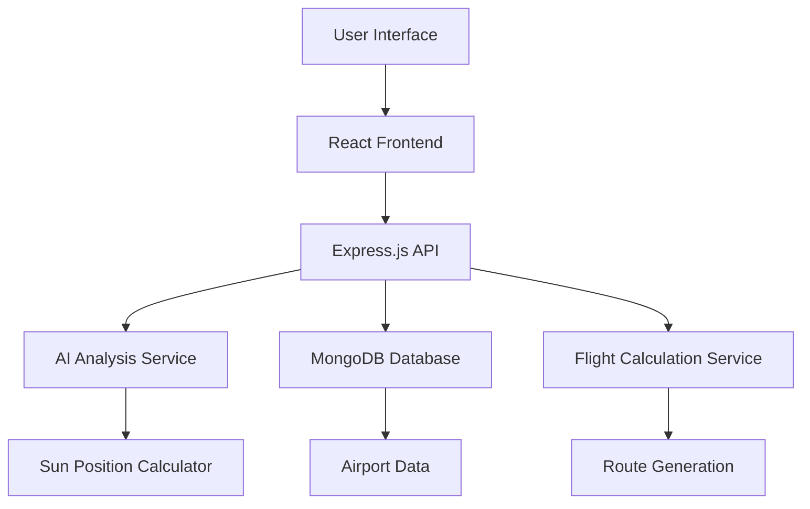

# ✈️ Flight Seat Recommender

<div align="center">


**AI-Powered Window Seat Recommendations for Scenic Flight Views**

*Never miss a beautiful sunrise or sunset from your airplane window again!*

</div>

---

## 🌅 Problem Statement

Many travelers want to enjoy breathtaking sunrises, sunsets, and scenic views from their airplane window, but they often end up on the wrong side of the aircraft and miss these magical moments entirely. This application solves that problem by providing intelligent seat recommendations based on your flight route, departure time, and sun position analysis.

## ✨ Key Features

### 🎯 **Smart Seat Recommendations**
- **AI-powered analysis** of 100+ points along your flight route
- **Real-time sun position calculations** for optimal viewing
- **Personalized recommendations** based on flight direction and time
- **View scoring system** to rank the best seats

### 🗺️ **Interactive Flight Visualization**
- **Real-time flight path mapping** with sun position overlay
- **Interactive map** showing your journey
- **Point-by-point analysis** along the entire route
- **Visual indicators** for optimal viewing moments


### 🚀 **Modern User Experience**
- **Intuitive interface** requiring no technical knowledge
- **Real-time recommendations** with instant results
- **Mobile-responsive design** for travel planning on-the-go
- **Clear visual feedback** and explanations

## 🏗️ Architecture



## 🚀 Quick Start

### Prerequisites
- **Node.js** (v16 or higher)
- **MongoDB** (local or cloud instance)
- **npm** or **yarn**

### Installation

1. **Clone the repository**
   ```bash
   git clone https://github.com/yourusername/flight-seat-recommander.git
   cd flight-seat-recommander
   ```

2. **Install Backend Dependencies**
   ```bash
   cd backend
   npm install
   ```

3. **Install Frontend Dependencies**
   ```bash
   cd ../frontend
   npm install
   ```

4. **Environment Setup**
   Create `.env` file in `backend/` directory:
   ```env
   MONGODB_URI=mongodb://localhost:27017/flightview
   PORT=3000
   NODE_ENV=development
   ```

### Running the Application

1. **Start MongoDB** (if running locally)
   ```bash
   # Windows
   net start MongoDB
   
   # macOS
   brew services start mongodb-community
   
   # Linux
   sudo systemctl start mongod
   ```

2. **Initialize Database** (first time only)
   ```bash
   cd backend
   npm run migrate
   ```

3. **Start Backend Server**
   ```bash
   cd backend
   npm start
   ```

4. **Start Frontend Development Server**
   ```bash
   cd frontend
   npm run dev
   ```

5. **Access the Application**
   - Frontend: `http://localhost:5173`
   - Backend API: `http://localhost:3000`

## 🎯 How It Works

### 1. **Flight Input**
- Select departure and arrival airports
- Choose your departure date and time
- Optionally specify seat preferences

### 2. **Route Analysis**
- Generate 100+ waypoints along the flight path
- Calculate flight bearing and duration
- Determine optimal viewing conditions

### 3. **Sun Position Calculation**
- Real-time sun position for each waypoint
- Sunrise/sunset timing analysis
- View angle calculations for each seat side

### 4. **AI Recommendation**
- Analyze all data points with AI algorithms
- Score each seat side for optimal viewing
- Provide detailed reasoning and recommendations

### 5. **Interactive Visualization**
- Display flight path on interactive map
- Show sun position overlay
- Highlight optimal viewing moments

## 🛠️ Tech Stack

### Frontend
- **React 18** - Modern UI framework
- **Vite** - Fast build tool and dev server
- **Modern CSS** - Responsive design
- **Interactive Maps** - Flight visualization

### Backend
- **Node.js** - Runtime environment
- **Express.js** - Web framework
- **MongoDB** - Database with geospatial features
- **Mongoose** - ODM for MongoDB
- **SunCalc** - Astronomical calculations
- **Turf.js** - Geospatial analysis

### AI & Analysis
- **Custom AI algorithms** for seat scoring
- **Real-time sun position calculations**
- **Geospatial route optimization**
- **Predictive view analysis**

## 📊 API Endpoints

### Flight Recommendations
- `POST /api/flight/recommendation` - Get AI-powered seat recommendations
- `POST /api/flight/route` - Calculate flight route and waypoints

### Airport Search
- `GET /api/airports/search` - Search airports with advanced filters
- `GET /api/airports/nearby` - Find airports within radius
- `GET /api/airports/popular` - Get popular airports

### Sun Analysis
- `POST /api/sun/position` - Calculate sun position for coordinates

## 🎨 User Interface

The application features a clean, intuitive interface that guides users through the seat selection process:

1. **Landing Page** - Welcome screen with clear value proposition
2. **Airport Search** - Easy airport selection with autocomplete
3. **Flight Input** - Simple form for flight details
4. **Results Display** - Clear recommendations with explanations
5. **Interactive Map** - Visual flight path with sun overlay

## 🌟 Key Benefits

- **Never miss scenic views** - Get the right seat every time
- **Save time and money** - No more guessing or disappointment
- **Travel smarter** - Make informed decisions about your flight
- **Enhance your journey** - Turn every flight into a scenic experience


---

<div align="center">

**Made with ❤️ for travelers who love scenic views**

[⭐ Star this repo](https://github.com/yourusername/flight-seat-recommander) | [🐛 Report Bug](https://github.com/yourusername/flight-seat-recommander/issues) | [💡 Request Feature](https://github.com/yourusername/flight-seat-recommander/issues)

</div>